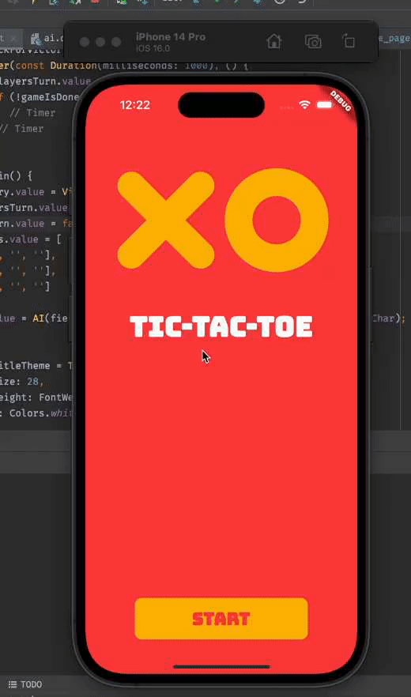
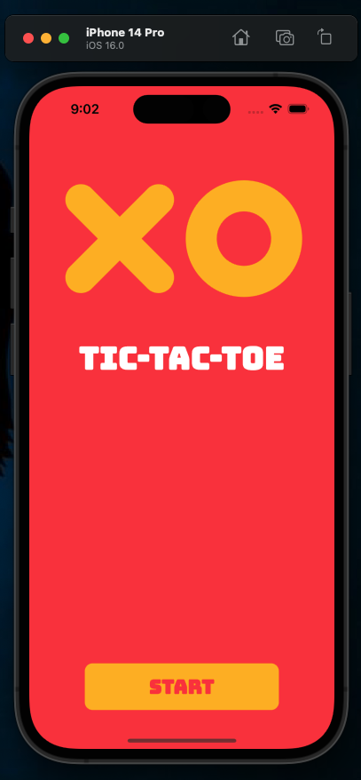

# TicTacToe

Simple TicTacToe app made with Flutter
Try out the DEMO here
[Link to Demo](https://tictactoe.jideguru.dev/)

## ✨ Features

#### Available Features
- [x] Animations.
- [x] Simple game 'AI'

#### Features to Explore
- [ ] Offline multiplayer
- [ ] Online multiplayer

## 💻 Requirements

- Any Operating System (ie. MacOS X, Linux, Windows)
- Any IDE with Flutter SDK installed (ie. IntelliJ, Android Studio, VSCode etc)
- A little knowledge of Dart and Flutter

## 📸 ScreenShots

## 🤓 Author(s)

**Olusegun Festus Babajide**

## 🔖 LICENCE

[Apache-2.0](https://github.com/JideGuru/flutter-tic-tac-toe/blob/master/LICENSE)

## Getting Started

This project is a starting point for a Flutter application.

A few resources to get you started if this is your first Flutter project:

- [Lab: Write your first Flutter app](https://docs.flutter.dev/get-started/codelab)
- [Cookbook: Useful Flutter samples](https://docs.flutter.dev/cookbook)

For help getting started with Flutter development, view the
[online documentation](https://docs.flutter.dev/), which offers tutorials,
samples, guidance on mobile development, and a full API reference.
